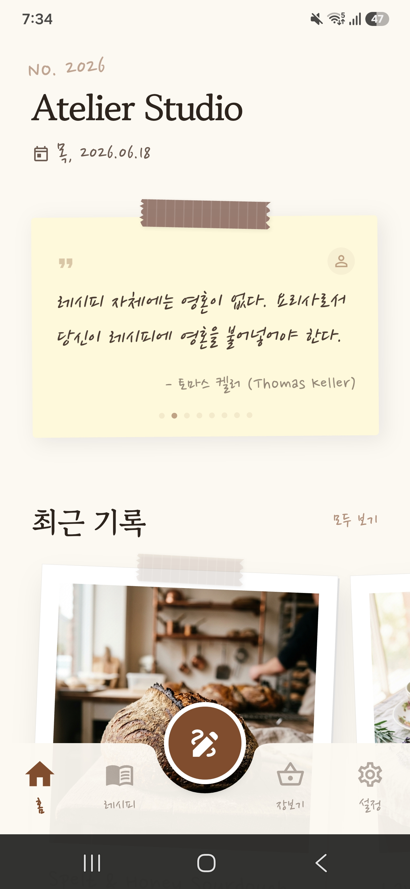
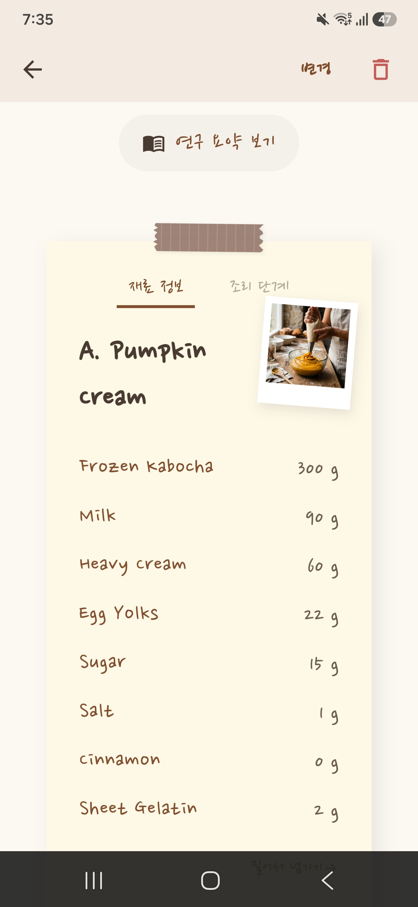
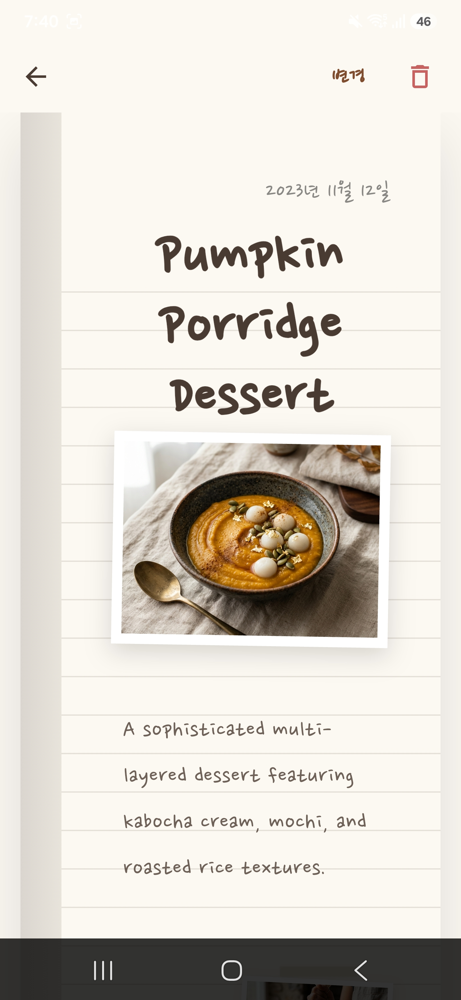
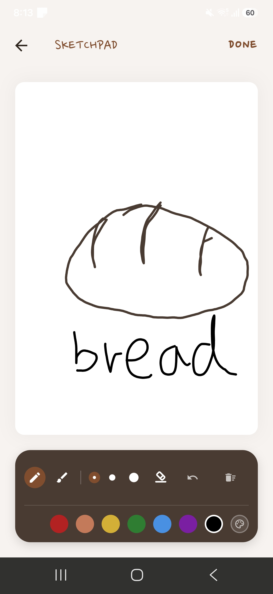
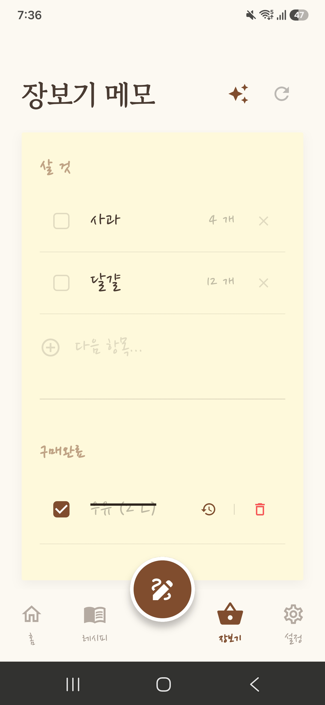

<div align="center">
  <!-- 로고 이미지가 있다면 여기에 추가하세요 -->
  <!--  -->
  
  # My Atelier (마이 아뜰리에) 📖🎨
  
  **손글씨 감성 템플릿과 손그림 커버로 나만의 특별한 레시피를 예쁘게 기록하는 요리 일지 앱**
  
  [](#)
  [](#)
  [](#)
</div>

<br/>

## 📷 스크린샷 (Screenshots)
> 앱의 주요 실행 화면입니다. 

| 홈 대시보드 | 레시피 기록 | 줄노트 레시피 | 스케치패드 드로잉 | 장보기 메모 |
| :---: | :---: | :---: | :---: | :---: |
|  |  |  |  |  |

<br/>

## 🌟 주요 기능 (Key Features)

### 1. 🏡 아늑한 홈 대시보드
* **오늘의 요리 명언**: 요리 감성을 깨워주는 매일의 명언 카드 제공
* **최근 일지**: 가장 최근에 기록한 요리 카드에 빠르게 접근 가능

### 2. 📸 폴라로이드 감성 레시피 보관함
* **카드형 보관함**: 정성스레 수집한 요리 일지를 따뜻한 폴라로이드 사진첩 형태로 감상
* **검색 및 필터링**: 수많은 레시피 카드 속에서 원하는 요리를 즉시 검색

### 3. ✍️ 아날로그 줄노트 레시피
* **손글씨 레이아웃**: 입력한 요리 정보가 편안한 손글씨 서체와 줄노트 위에 조화롭게 렌더링
* **빠른 탭 전환**: 요리 중 터치 한 번으로 **재료 계량** 정보와 **조리 과정**을 손쉽게 오갈 수 있음

### 4. 🎨 커스텀 손그림 스케치패드
* **다양한 드로잉 도구**: 연필(불투명), 붓(반투명 형광펜 효과) 및 직접 제작한 사선형 지우개 지원
* **디테일한 설정**: 3단계 선 굵기 조절 및 정교한 HSV 색상 스펙트럼 피커 제공
* 나만의 예쁜 레시피 표지를 직접 그려서 설정 가능

### 5. 📝 감성 장보기 메모
* **체크리스트**: 장보기 준비를 위해 필요한 식재료 리스트를 포스트잇 감성으로 작성
* 항목을 하나씩 지워나갈 수 있어 실용적이고 편리함

<br/>

## 🛠️ 기술 스택 (Tech Stack)

* **Framework**: Flutter (크로스 플랫폼 모바일 앱 개발)
* **Language**: Dart
* **State Management**: Riverpod (반응형 상태 관리)
* **Local Database**: Hive (오프라인 환경에서도 빠르고 가벼운 NoSQL 로컬 저장소)
* **UI/UX & Graphics**: CustomPainter (스케치패드 및 벡터 지우개 아이콘 직접 구현), Google Fonts (아날로그 손글씨 서체 적용)

<br/>

## 📁 디렉토리 구조 (Folder Structure)

```text
lib/
 ├── models/       # 데이터 모델 (레시피, 식재료 등)
 ├── providers/    # Riverpod 상태 관리 프로바이더
 ├── screens/      # UI 화면 (대시보드, 보관함, 스케치패드 등)
 ├── services/     # 비즈니스 로직 및 로컬 DB (Hive) 처리
 ├── theme/        # 폰트, 색상 등 디자인 시스템 (ArtisanalTheme)
 ├── widgets/      # 재사용 가능한 커스텀 UI 컴포넌트
 └── main.dart     # 앱 진입점
```

<br/>

## 📄 라이선스 (Contact & License)
이 프로젝트는 앱 개발 포트폴리오 목적으로 제작되었습니다.
